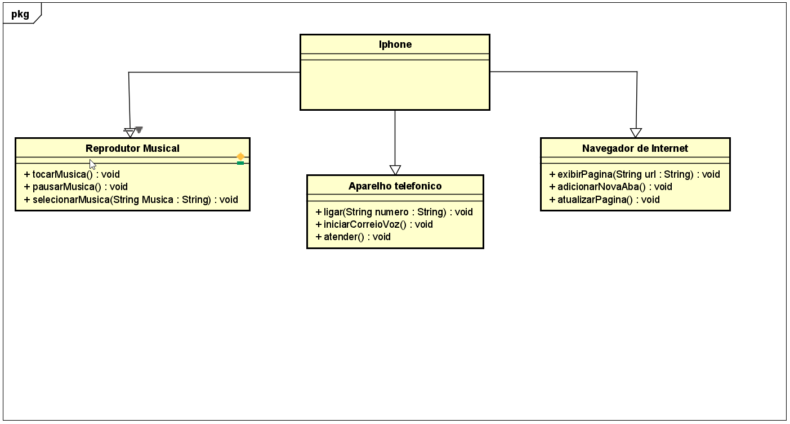

## Desafio Iphone

Desafio da DIO para fazer um diagrama em UML.

## Proposta 
[Desafio](https://github.com/glysns/trilha-java-basico/desafios/poo/README.md)

1- Criar um diagrama UML que represente as funcionalidades descritas acima.

2 - Implementar as classes e interfaces  - correspondentes em Java (Opcional).

[Resolução](https://github.com/Rbriitto/Iphone/tree/novabranch/src)

